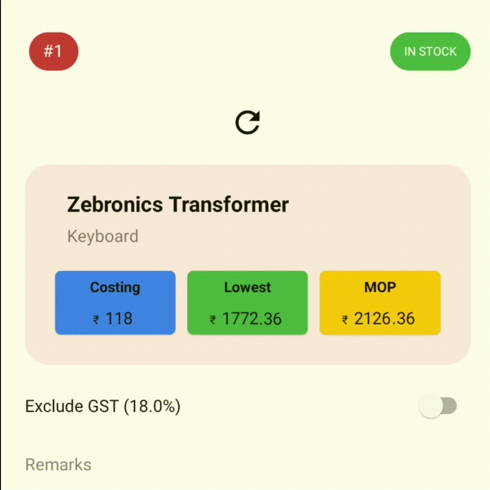

# SpinningImageView

ImageView that can be spinned on function call. Use it as a onclick loader.

## Sample

## Implementation
**Step 1:** Add to project level build.gradle

    allprojects {
		repositories {
			...
			maven { url 'https://jitpack.io' }
		}
	}

**Step 2:** Add to app level build.gradle

	dependencies {
	    implementation 'com.github.u-barnwal:SpinningImageView:VERSION'
	}
## How to use
**Step 1:** Create view

    <com.isolpro.library.SpinningImageView
      android:layout_width="wrap_content"
      android:layout_height="wrap_content"
      android:src="@drawable/ic_action_reload"
      app:siv_alwaysSpinning="false"
      app:siv_duration="800"
    />

**Start spinning programmatically**

    spinningImageView.spin();

**Stop spinning programmatically**

    spinningImageView.stop();

**Auto start spinning and spin till the end**

    spinningImageView.setAlwaysSpinning(true);

**Change spin duration**

    spinningImageView.setDuration(1000); // 1000ms = 1s

## Features

 - Used just like default ImageView widget
 - Auto disabling/enabling spin on visibility change (to improve performance)
 - Use as smart loader
 - Light weight
 - Easy to use

## Links
 - Inspiration: https://kylewbanks.com/blog/infinitely-rotating-imageview-on-android
